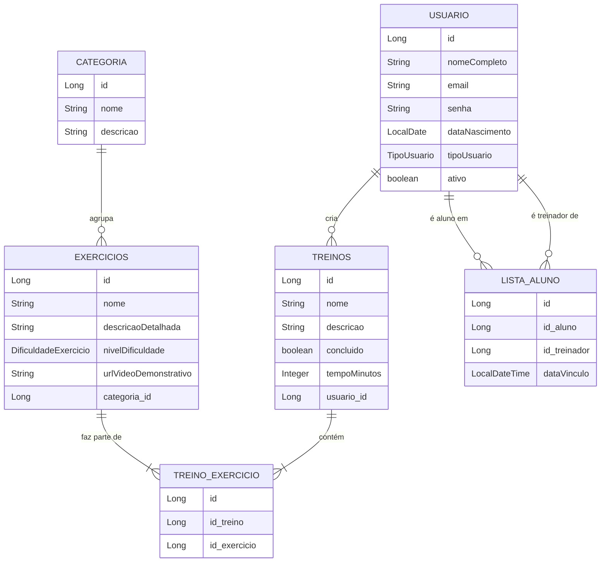

# **HealthSync API 💪**

<div align="center">
  
</div>

<p align="center">
  
  
  
  
</p>

---

## 📖 **Sobre o Projeto**

A **HealthSync API** é uma solução backend robusta desenvolvida em **Java 17 + Spring Boot 3**, criada para **otimizar e gerenciar treinos personalizados, exercícios e o relacionamento entre treinadores e alunos**.  

O projeto segue o padrão **RESTful**, com autenticação via **JWT** e arquitetura em camadas (Controller → Service → Repository), garantindo **segurança, escalabilidade e integração simplificada** com aplicações frontend.

---

## ✨ **Principais Funcionalidades**

- **👤 Gerenciamento de Usuários**  
  CRUD completo para usuários, com distinção entre perfis (`ALUNO`, `TREINADOR`).
  
- **🔐 Segurança JWT**  
  Autenticação e autorização de endpoints por role utilizando **Spring Security + JWT**.

- **🏋️ Exercícios e Categorias**  
  CRUD de exercícios e agrupamento por categorias para melhor organização.

- **💪 Treinos Personalizados**  
  Criação de treinos associados a exercícios e a alunos específicos.

- **🔄 Vínculo Treinador-Aluno**  
  Treinadores autenticados podem cadastrar alunos e vinculá-los automaticamente.

- **📈 Rastreamento de Progresso**  
  Marcação de treinos concluídos com atualização automática de métricas.

---

## 🏛️ **Arquitetura e Diagrama de Classes**

A arquitetura utiliza **DTOs** para proteger dados sensíveis e **Spring Data JPA** para persistência.  
Abaixo, um diagrama representando as entidades e seus relacionamentos:



---

## 🛠 **Tecnologias Utilizadas**

| Tecnologia / Ferramenta       | Uso no Projeto |
|-------------------------------|----------------|
| **Java 17**                   | Linguagem principal |
| **Spring Boot 3.x**            | Framework backend |
| **Spring Data JPA / Hibernate**| ORM e persistência |
| **MySQL / H2**                 | Banco de dados (produção/dev) |
| **Spring Security + JWT**      | Autenticação e autorização |
| **Bean Validation (JSR 380)**  | Validação de dados |
| **Swagger / OpenAPI**          | Documentação da API |
| **JUnit / Insomnia**           | Testes e requisições |

---

## 📄 **Documentação (Swagger)**

Após rodar o projeto, a documentação estará disponível em:  
```
http://localhost:8080/swagger-ui.html
```

---

## 🚀 **Como Executar o Projeto**

```bash
# 1. Clone o repositório:
git clone https://github.com/Grupo-02-Turma-Java-82/HealthSync_API.git

# 2. Abra na IDE de sua preferência (IntelliJ, Eclipse, VSCode com extensão Java)

# 3. Configure o banco de dados no application.properties

# 4. Execute:
./mvnw spring-boot:run
```

---

## 👥 **Integrantes**

| Nome                | GitHub                                           | Função                 |
|---------------------|--------------------------------------------------|------------------------|
| Bruno Godoy         | [Brunogodoy2911](https://github.com/Brunogodoy2911) | Dev/Master         |
| Felipe Peronica     | [feperonica](https://github.com/feperonica)     |  Dev      |
| Jovani de Souza     | [JovaniOUnico](https://github.com/JovaniOUnico) | Dev            |
| Lívia D’Alexandri   | [liviadalexandri](https://github.com/liviadalexandri) | Dev               |
| Luiza Gonçalves     | [luizaeg](https://github.com/luizaeg)           | Tester                 |
| Maria Helena        | [squarcinihelena](https://github.com/squarcinihelena) | Dev               |
| Rafaela Giometti    | [rafagiometti](https://github.com/rafagiometti) | Dev                    |

---

## 📌 **Status do Projeto**

🟡 **Em desenvolvimento** — funcionalidades principais concluídas, melhorias e novas features em andamento.
