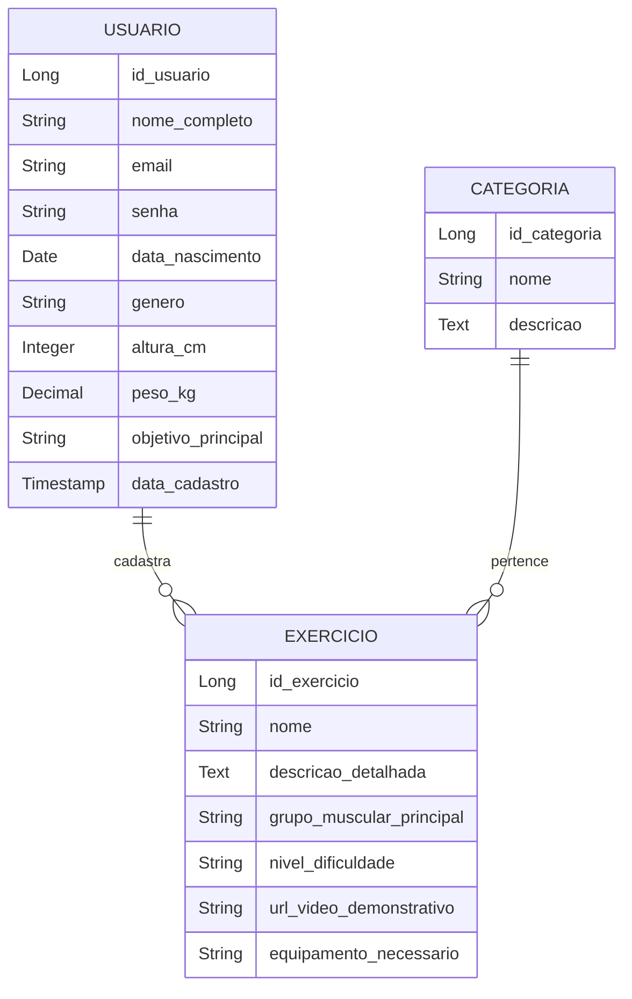

# 💪 HealthSync - Sistema Fitness Personalizado

<div align="center">
    
</div>

<br />

<div align="center">
  
  
  
  
</div>

---


## 1. Descrição

O **HealthSync** é um sistema de fitness personalizado desenvolvido em **Java com Spring Boot**, com foco na organização de treinos por categoria, cadastro de exercícios e gerenciamento de usuários. A aplicação conta com **CRUD completo**, **autenticação segura via JWT** e estrutura preparada para integrar com aplicações front-end.

---

## 2. Funcionalidades

- Cadastro, busca, atualização e exclusão de usuários
- Cadastro de exercícios com vínculo a categorias
- Consulta de exercícios por nível de dificuldade, grupo muscular, etc.
- Autenticação e geração de token JWT para login seguro
- Relacionamento entre entidades com JPA
- Proteção de rotas e validações com Spring Security
- Registro automático com data de cadastro

---

## 3. Diagrama de Classes




---

## 4. Tecnologias utilizadas

| Item                          | Descrição                         |
|-------------------------------|-----------------------------------|
| **Servidor**                  | Apache Tomcat (Spring Boot)       |
| **Linguagem**                 | Java 17                           |
| **Framework**                 | Spring Boot 3.x                   |
| **ORM**                       | Spring Data JPA / Hibernate       |
| **Banco de Dados**            | H2 (dev) / MySQL (produção)       |
| **Segurança**                 | Spring Security + JWT             |
| **Validação**                 | Bean Validation (JSR 380)         |
| **Documentação**              | Swagger / OpenAPI (opcional)      |
| **Testes**                    | Postman / Insomnia                |

------

## 5. Configuração e Execução

```bash
# 1. Clone o repositório:
git clone https://github.com/Grupo-02-Turma-Java-82/HealthSync.git

# 2. Abra na IDE (VSCode, IntelliJ, Eclipse ou STS)

# 3. Configure o banco de dados no application.properties

# 4. Rode a aplicação:
./mvnw spring-boot:run
```

---

## 6. Participantes

Este projeto foi desenvolvido por:

| Nome                | GitHub                                           | Função                 |
|---------------------|--------------------------------------------------|------------------------|
| Bruno Godoy         | [Brunogodoy2911](https://github.com/Brunogodoy2911) | Dev/Master         |
| Felipe Peronica     | [feperonica](https://github.com/feperonica)     |  Dev      |
| Jovani de Souza     | [JovaniOUnico](https://github.com/JovaniOUnico) | Dev            |
| Lívia D’Alexandri   | [liviadalexandri](https://github.com/liviadalexandri) | Dev               |
| Luiza Gonçalves     | [luizaeg](https://github.com/luizaeg)           | Tester                 |
| Maria Helena        | [squarcinihelena](https://github.com/squarcinihelena) | Dev               |
| Rafaela Giometti    | [rafagiometti](https://github.com/rafagiometti) | Dev                    |

## 7. Status do Projeto

🟡 Em desenvolvimento — funcionalidades principais concluídas, melhorias em andamento.

---
